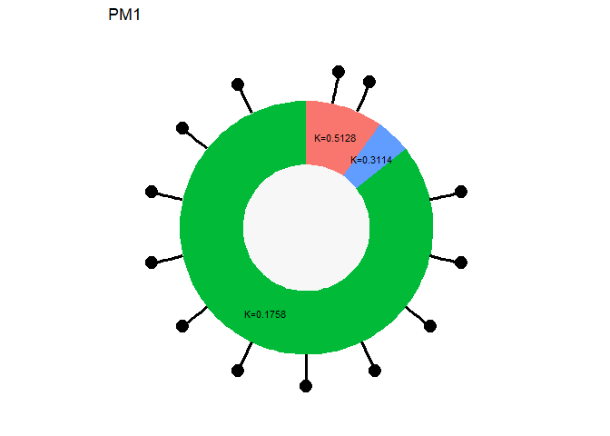
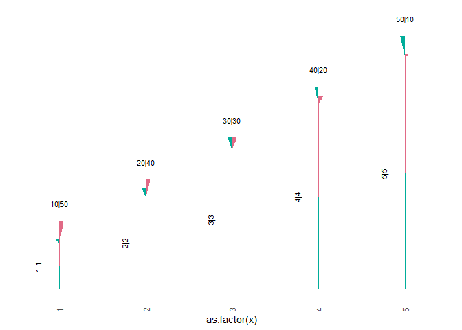
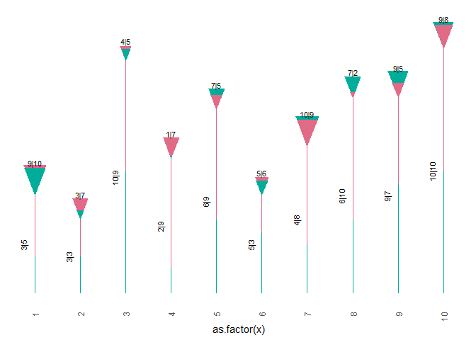

|                         |
|-------------------------|
| output: github_document |

<!-- README.md is generated from README.Rmd. Please edit that file -->

# phylogenies

<!-- badges: start -->
<!-- badges: end -->

The goal of phylogenies is to visualize cancer phylogenies, also
introduce using new point shape (upside down half-triangle) for
visualization.

## Installation

You can install the development version of phylogenies from
[GitHub](https://github.com/) with:

``` r
# install.packages("devtools")
devtools::install_github("Leslie2101/phylogenies")
```

## Example

This is a basic example which shows you how to solve a common problem:

### 1. Visualizing driver-annotated PyClone

``` r
library(phylogenies)
data <- sample_pyclone_data
print(head(data, 3))
#>   mutation_id sample_id cluster_id cellular_prevalence cellular_prevalence_std
#> 1        MUT1       PM1          0              0.9951                  0.0081
#> 2        MUT2       PM1          0              0.9951                  0.0081
#> 3        MUT3       PM1          0              0.9951                  0.0081
#>   cluster_assignment_prob isDriver
#> 1                  1.0000    FALSE
#> 2                  0.9999     TRUE
#> 3                  1.0000     TRUE
make_pyclone_donut_plot(data)
```



### 2. Make half-triangle plot

``` r
df <- data.frame(x = 1:5,
                 y1 = 1:5,
                 y2 = 1:5,
                 z1 = seq(10, 50, length.out=5),
                z2 = seq(50, 10, length.out=5))
make_half_triangle_plot(df, x = as.factor(x),
                         y_1= y1, y_2= y2,
                         z_1 = z1, z_2 = z2)
```



### 3. Make full-triangle plot

``` r
set.seed(123) # For reproducibility
df <- data.frame(
  x = 1:10,
  y1 = sample(1:10, 10, replace = TRUE),
  y2 = sample(1:10, 10, replace = TRUE),
  z1 = sample(1:10, 10, replace = TRUE),
  z2 = sample(1:10, 10, replace = TRUE)
)

make_full_triangle_plot(df, x = as.factor(x), y_1= y1, y_2=y2, z_1 = z1, z_2 = z2)
```



<!-- You'll still need to render `README.Rmd` regularly, to keep `README.md` up-to-date. `devtools::build_readme()` is handy for this. -->
<!-- In that case, don't forget to commit and push the resulting figure files, so they display on GitHub and CRAN. -->
